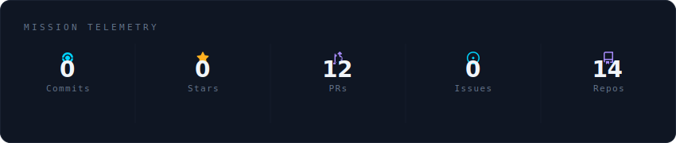

  

 

  

 

  

 

  

 

<strong>More about me</strong>

 

Building backend systems with Java and Spring Boot.
Focused on API gateways, service discovery, authentication, and domain-oriented microservices.

Currently building HMS, a hospital management platform based on Spring Boot microservices, JWT auth, API Gateway, Eureka, and MySQL per domain.

 

  
  

